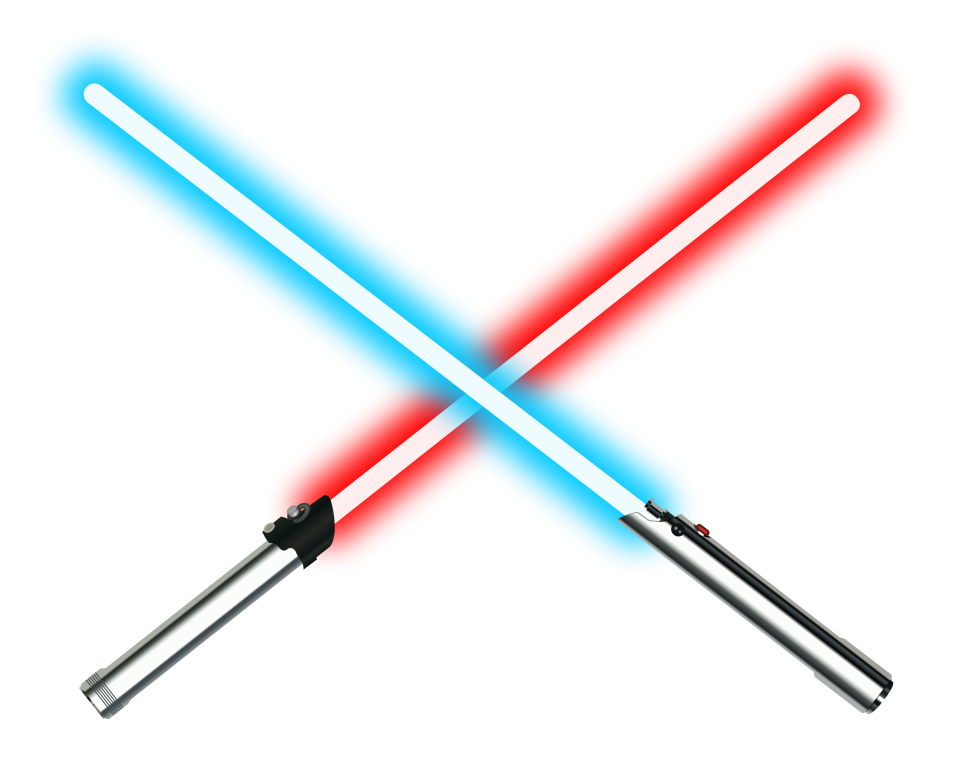

# <center>  CLIghtsaber </center>

## Useless cli tool that prints light-saber in your terminal


[](https://www.npmjs.com/package/clightsaber)
[](https://www.npmjs.com/package/clightsaber)

### This fun project try to follow [Nodejs-cli-apps best practices](https://github.com/lirantal/nodejs-cli-apps-best-practices)

### Inspired by [Jeff Delaney](https://github.com/codediodeio)'s (AKA [Fireship.io](https://www.youtube.com/channel/UCsBjURrPoezykLs9EqgamOA)) [video](https://youtu.be/_oHByo8tiEY)

---

## Usage

Run

```shell
npx clightsaber [color]
```

`[color]` is optional parameter

For example: `npx clightsaber` will log a blue saber.

You can also install it globally by running

```shell
npm i -g clightsaber
```

Then run `clightsaber [color]`

## Available colors

- Red
- Green
- blue
- Yellow
- Cyan
- Magenta
- White

The default color is Blue

You can also use `random` to generate a random color

> The code will convert the input to lower-case so you can use whatever letter casing you want.

### Incase you insert a color that not exist you'll get an error message

You can also use the `--help` flag to see all color options
