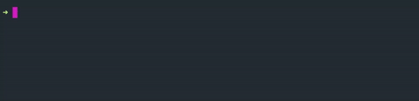

# CLIghtsaber

> Logging a light-saber in your terminal



[](https://www.npmjs.com/package/clightsaber)
[](https://www.npmjs.com/package/clightsaber)

## A fun CLI tool trying to follow [nodejs-cli-apps-best-practices](https://github.com/lirantal/nodejs-cli-apps-best-practices) For practical learning and having fun.

## Inspired by [Jeff Delaney](https://github.com/codediodeio)'s (AKA [Fireship.io](https://www.youtube.com/channel/UCsBjURrPoezykLs9EqgamOA)) [video](https://youtu.be/_oHByo8tiEY)

## Usage

```shell
npx clightsaber [color]
```

For example: `npx clightsaber` will log a blue saber.

Available colors: red, green, blue, yellow, cyan, magenta, white
