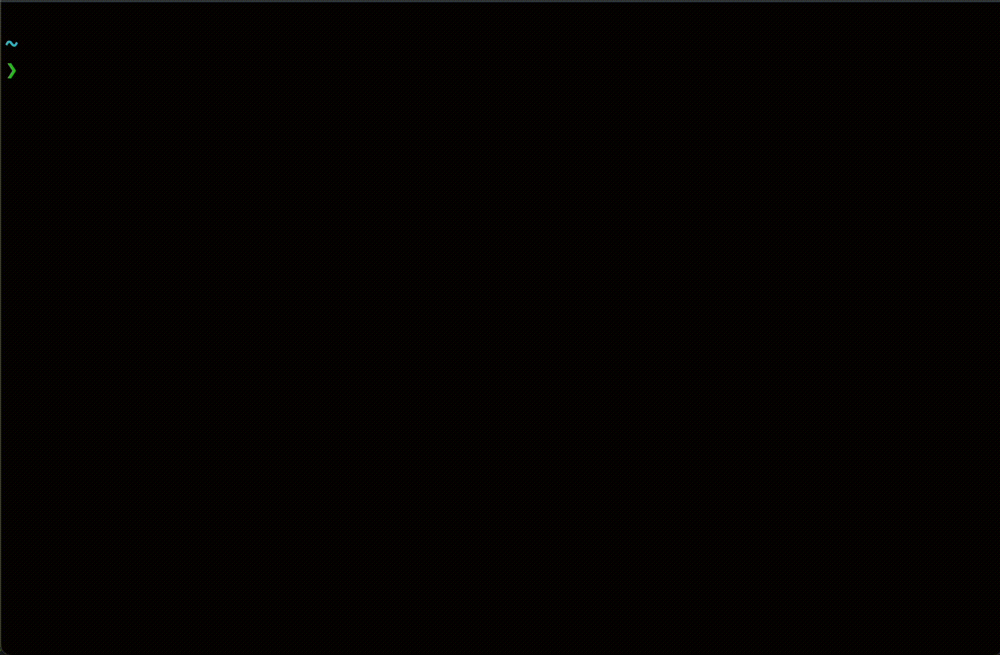

# CLIghtsaber

## Useless cli tool that log a light-saber in your terminal



[](https://www.npmjs.com/package/clightsaber)
[](https://www.npmjs.com/package/clightsaber)

A fun CLI tool trying to follow [nodejs-cli-apps-best-practices](https://github.com/lirantal/nodejs-cli-apps-best-practices) For practical learning and having fun.

Inspired by [Jeff Delaney](https://github.com/codediodeio)'s (AKA [Fireship.io](https://www.youtube.com/channel/UCsBjURrPoezykLs9EqgamOA)) [video](https://youtu.be/_oHByo8tiEY)

## Usage

```shell
npx clightsaber [color]
```

`[color]` is optional variable

For example: `npx clightsaber` will log a blue saber.

You can also install it globally by running

```shell
npm i -g clightsaber
```

and then run `clightsaber [color]`

## Available colors

- Red
- Green
- blue
- Yellow
- Cyan
- Magenta
- White

The default color is blue

The code will convert the input to lower-case so you can use whatever letter casing you want.
